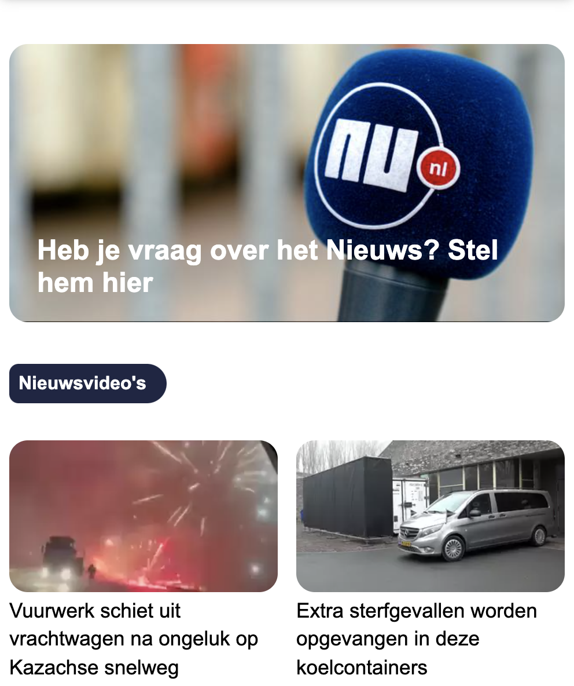

# Procesverslag
Markdown is een simpele manier om HTML te schrijven.  
Markdown cheat cheet: [Hulp bij het schrijven van Markdown](https://github.com/adam-p/markdown-here/wiki/Markdown-Cheatsheet).

Nb. De standaardstructuur en de spartaanse opmaak van de README.md zijn helemaal prima. Het gaat om de inhoud van je procesverslag. Besteedt de tijd voor pracht en praal aan je website.

Nb. Door *open* toe te voegen aan een *details* element kun je deze standaard open zetten. Fijn om dat steeds voor de relevante stuk(ken) te doen.

## Jij

uitwerken voor kick-off werkgroep

### Auteur:
Nigel Fijnheer

#### Je startniveau:
Rood

#### Je focus:
Responsive
 

## Je website

uitwerken voor kick-off werkgroep

### Je opdracht:
https://www.nu.nl/

#### Screenshot(s) van de eerste pagina (small screen): 
Algemeen

#### Screenshot(s) van de tweede pagina (small screen):
Login pagina 

 

## Breakdownschets (week 1)

uitwerken na afloop 2e werkgroep

### de hele pagina: 

### Dynamisch deel (Menu): 

## Voortgang 1 (week 2)

uitwerken voor 1e voortgang

### Stand van zaken
Het koste mij wel wat tijd om echt op te starten met mijn website. Toen ik bezig was ging het wel. In ben begonnen met de header van mijn pagina. Ik heb dit gemaakt met flex box. Ik heb zelf nog wat moeite met flex box, maar meestal lukt het uiteindelijk wel. Toen ik begon met de eerste section kwam ik erachter dat ik een fout had gemaakt met de CSS selectors, daar heb ik een tijd vast gezeten.

### Agenda voor meeting
samen met je groepje opstellen

| Nigel          | student 2          |
| ---            | ---                |
|                | Flexbox            | 
| Flexbox        | Opstarten          | 
| ...            | ...                | 

### Verslag van meeting

Tijdens de meeting heb ik te horen gekregen dat mijn Github niet helemaal klopt. Dit heb ik tijdens de meeting opgelost.

## Voortgang 2 (week 3)

uitwerken voor 2e voortgang

### Stand van zaken
Week 3 heb ik heel wat voortgang gemaakt meet mijn website. Het is me gelukt om de hele basis van de website in elkaar te zetten. Ik weet alleen niet zo goed wat de volgende stap is, dat is wat ik wil bespreken in de meeting. Veel van mijn website heb ik gemaakt met grid met een combinatie van flexbox.

Alle verschillende articles heb ik naast elkaar gezet met grid, en alles wat daar in zit heb ik opgelost met flexbox.

Ook waar ik even op vast liep was mijn menu. Dit is een dropdown menu die onder de header valt. Ik wou dit oplossen met z-index, maar dit werkte niet. Wat er mis was is dat er geen position op de header zat, daarom werkte het niet.

### Agenda voor meeting
samen met je groepje opstellen

### Verslag van meeting
Ik had zelf geen vragen tijdens de meeting. Ik heb mijn voortgang besproken en kan weer verder met mijn opdracht. Ook de rest van mijn groepje hadden geen specifieke vragen.

## Toegankelijkheidstest (week 4)

uitwerken na test in 8e voortgang

### Bevindingen
Lijst met je bevindingen die in de test naar voren kwamen:

#### Gebruik van toetsenbord met screenreader

Je kan met de tab toets door de hele website heen scrollen. De linkes worden uitgelezen opgelzen met de screenreader. Je kan met de meer knop het dropdown menu openen, maar het is lastig om terug naar de menu knop te gaan om dit menu weer te sluiten. Ook elke keer als hij over een artiekel heen gaat wordt dit genoemd.

Een mogelijkheid om met een toets het menu te sluiten, of om terug te komen naar de knop om het te sluiten.

#### Naivgeren met toetsenbord
Er is geen mogelijkheid om terug te gaan naar het menu van de pagina. Als je dus met je tab toets verder gaat naar de artiekelen moet je de hele pagina door of terug om bij het menu te komen, of de pagina refreshen.

Een manier hoe je gelijk weer terug kan naar het menu met de druk van een knop.

#### Testen met verschillende brillen 
Eerst heb ik getest met een bril die de kleuren aanpast. Het contrast word soms minder, maar alles is nog leesbaar.

Met de bril die je zicht verminderd is nog steeds alles te zien, het is wel minder scherp.

Met de bril die alles minder scherp maakt is eigenlijk niks meer te zien van de website, ook als de letters groter worden, of als het contrast veranderd. Op dit moment kan je beter de screen reader gebruiken.

#### Testen met elektrische simulator
Bij het gebruiken van de simulator is het lastig om op kleine linkjes te klikken. Ook het gebruiken van het toetsenbord is lastig.

De menu knoppen zouden misschien iets groter kunnen.

#### Conclusie

Over het algemeen is de site redelijk toegankelijk. Het gebruik van de screenreader is werkt en ook is de website erg goed te bedienen met de tab toets. Omdat je nog door het hele menu heen gaat is het misschien een oplossing om een knop toe te voegen met :focus die je gelijk naar de content brengt. Omdat het zwarte tekst op een witte achtergrond is werkt dit erg goed met verschillende brillen. Hier wil ik niks aan veranderen.

## Voortgang 3 (week 4)

uitwerken voor 3e voortgang

### Stand van zaken
Deze week heb ik veel gewerkt aan de content van de pagina. Ik had eerst alleen maar placeholder images en tekst. Dit heb ik vervangen door echte content. Ik dacht dat dit nog wel wat voor problemen zou zorgen. Dat bijvoorbeelden dingen naar onder werden gezet, maar dit gebeurde gelukkig niet. Verder heb ik de toegankelijkstest gedaan en ervoor gezorgt dat eigenlijk alles van de pagina is te bedienen met de tab toets.

### Agenda voor meeting
samen met je groepje opstellen

| Nigel          |
| ---            | 
| bediening met  |
| tab toets      |
|                | 
|                | 

### Verslag van meeting
Ik heb te horen gekregen dat ik moet gaan kijken naar :focus-within om het probleem met de tab toets op te lossen.

## Eindgesprek (week 5)

uitwerken voor eindgesprek

### Stand van zaken
Het maken van NU.nl was eigenlijk erg goed te doen. Ik heb veel gebruik gemaakt van de display flex en grid om dit voor elkaar te krijgen. Ik heb ervoor gekozen om mijn website responsive te maken, dit is wel redelijk gelukt. Ik heb alleen geen gebruik gemaakt van media query's om dit te doen. Verder had ik mezelf wel iets meer kunnen uitdagen, want ik had er niet heel veel moeite mee. 

### Screenshot(s)

hier screenshot(s) van je eindresultaat

### Conclusie
Tijdens het eindgesprek kreeg ik te horen dat mijn website nog niet voldoende is. Ik zou de website responsive maken, maar dit was nog niet helemaal gedaan zoals verwacht werd. Ook de content kan wel wat meer, want alles lijkt op elkaar. Het zijn allemaal plaatjes met een stukje tekst erbij. 

Om dit nu te verbeteren wil ik alle puntjes aanpakken. Ik ga meer verschillende content toeveogen en de site beter responsive maken.

Herkansing

## Herkansing
Om met mijn herkansing te beginnen heb ik eerst nog eens gekeken naar wat ik gemaakt heb. Ik heb de content die ik heb beter responsive gemaakt en als het groter word dan 900 pixels komt dit nu in 2 kolommen te staan. Dit maakt de pagina beter responsive en nu veranderd de layout ook echt van de pagina. Dit heb ik gedaan met gebruik van media query's en css grid.

### Terug kijken naar toegankelijkheid
Daarna heb ik nog eens goed gekeken naar de toegankelijksheidsonderzoek. Ik heb het niet kunnen oplossen dat het menu goed werkt met de tab toets. Inplaats daar van heb ik een knop toegevoegd die alleen te zien is als je de website gebruikt met de tab toets. Deze laat je gelijk naar de content gaan.

Vervolgens heb ik ook nog een dark mode toegevoegd aan de pagina.

### Meer content
Om meer content toe te voegen heb ik nog eens naar de nu pagina gekeken om te kijken wat ik nog allemaal kan toevoegen. Ik ben begonnen met een klein stukje die het weer laat zien. Het plaatje heb ik gedaan met SVG. De pagina van nu had nog wel meer verschillende plaatjes als SVG, maar ik wou deze niet allemaal kopiëren omdat ik niet precies wist hoe deze in elkaar zaten. Ik heb gebruik gemaakt van de SVG zodat dit ook werkt met light en dark mode.

Vervolgens heb ik een FAQ stukje gemaakt. Dit stond zelf niet op de nu pagina, maar ik wou een keer gebruik maken van de details en summary elements. De vragen en antwoord heb ik wel van de nu pagina.

Ook heb ik nog gebruik gemaakt van de :invalid selector op de login pagina om aan te geven als een email niet klopt. Ik wou hier graag ook nog tekst aan toevoegen, maar dat is helaas niet gelukt. Als laatst heb ik nog meer hovers en animaties toegevoegd om het visueel nog wat beter te maken.

### Screenshot(s)

Screenshots eindresultaat na herkansing.

## Bronnenlijst

continu bijhouden terwijl je werkt

1. https://www.nu.nl/     | Als pagina 1 van mijn website, en de login pagina als pagina 2
2.  https://css-tricks.com/auto-sizing-columns-css-grid-auto-fill-vs-auto-fit/  | Om meer te weten to komen over Grid
3. https://css-tricks.com/snippets/css/a-guide-to-flexbox/   | Voor Flexbox
4. https://css-tricks.com/snippets/css/complete-guide-grid/   | Voor Grid
5. https://css-tricks.com/using-svg/      | Gebruik van SVG op homepage
6. https://css-tricks.com/how-to-create-a-skip-to-content-link/   | De naar content button voor gebruik met tab toets

